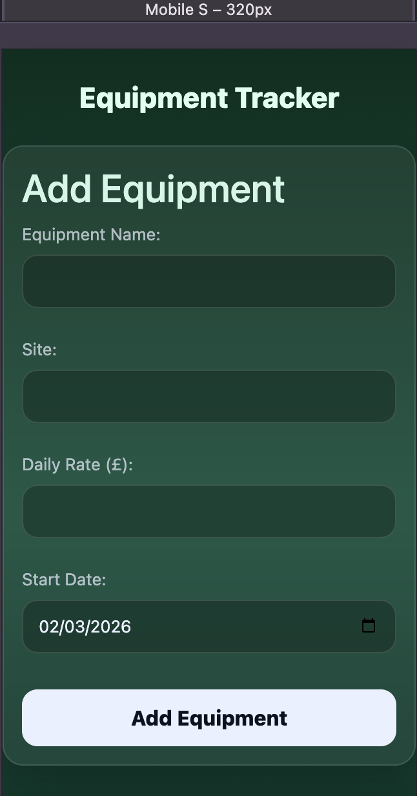
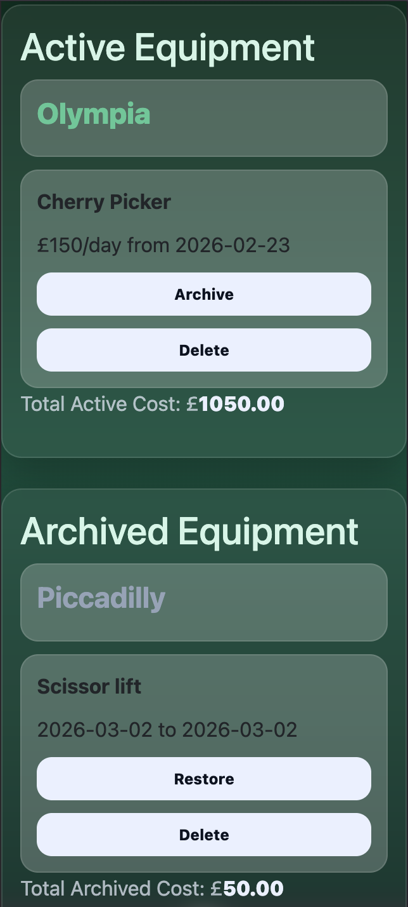
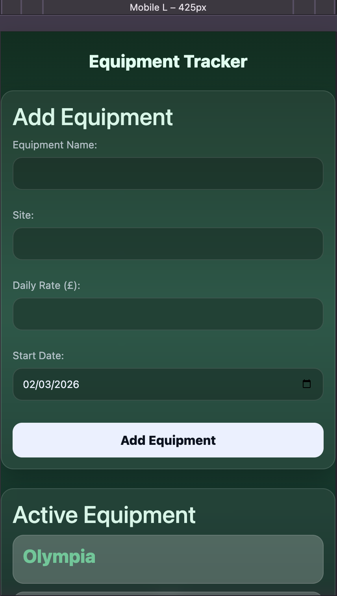
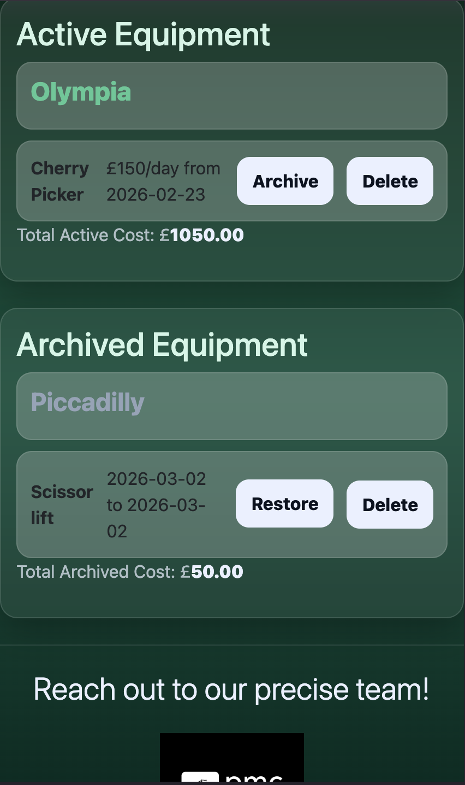
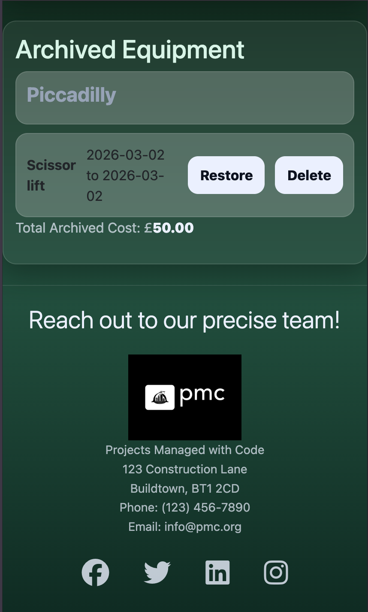
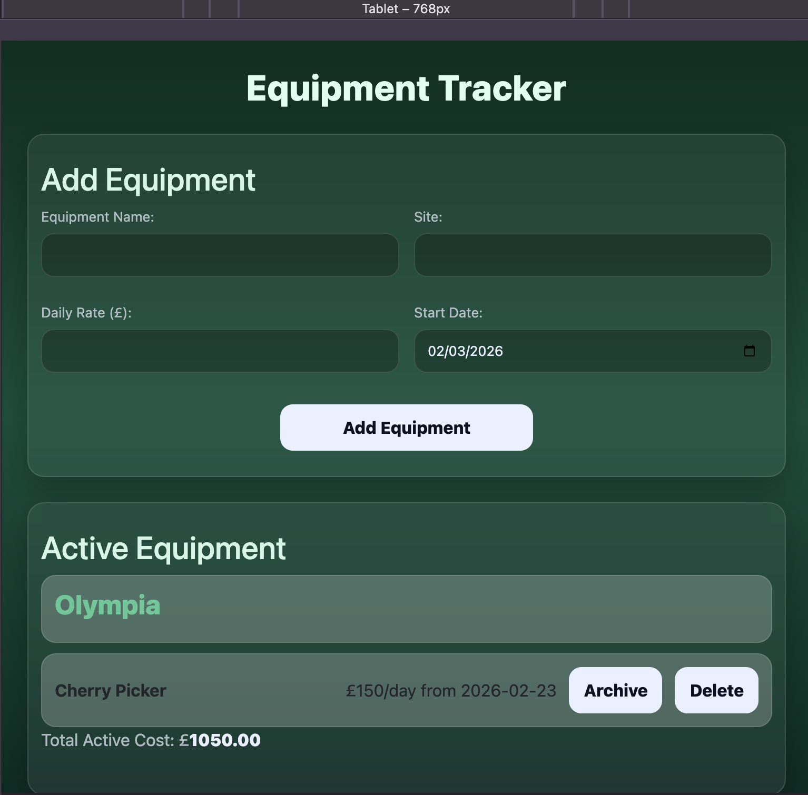
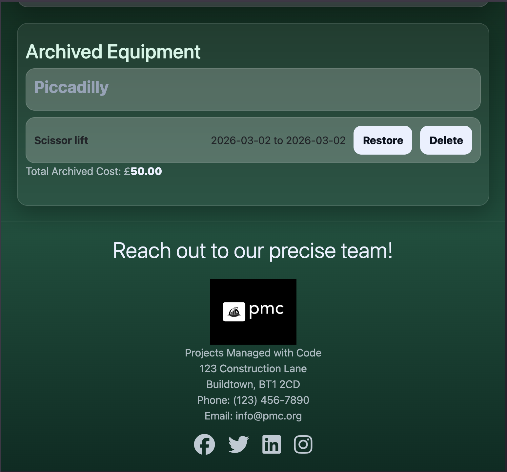
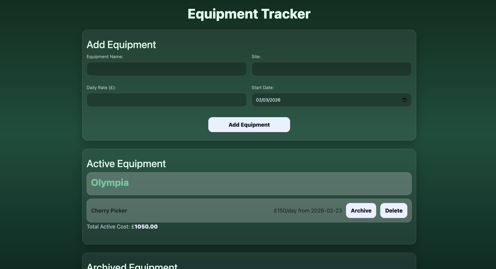
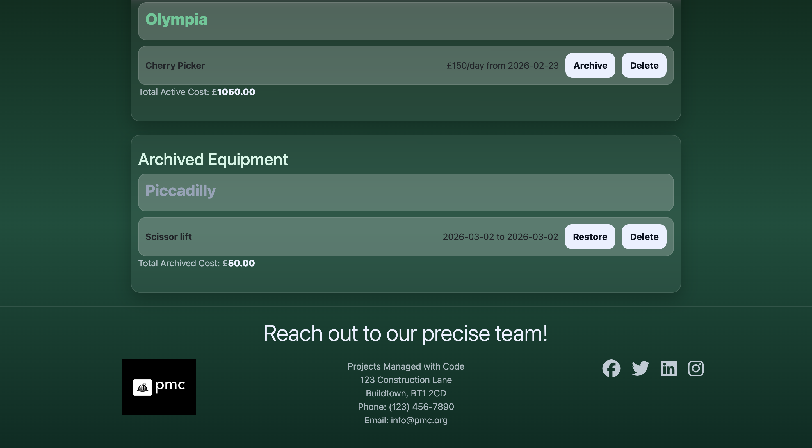
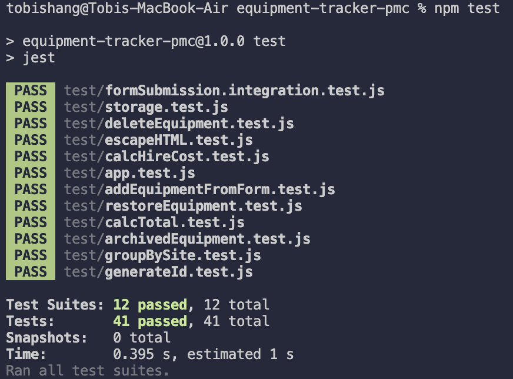

# Equipment Tracker – PMC

A Responsive Equipment Hire Management Application

[Live projecct](https://sshang93.github.io/equipment-tracker-pmc/)

1. Project Goals
---
## Primary Goal

*To build a responsive web application that allows construction supervisors to track hired equipment, calculate cost exposure, and maintain a clear operational record of active and archived assets.

## Secondary Goals

*Demonstrate clean JavaScript architecture

*Implement state-driven rendering

*Use LocalStorage for persistence

*Apply responsive design principles

*Validate logic using automated testing (Jest)

2.User Experience (UX)
---
*Target Audience

*Site Supervisors

*Project Managers

*Small Construction Businesses

*These users require:

*Quick visibility of hired assets

*Clear cost tracking

*Mobile accessibility on site

*Minimal learning curve

## User Stories

Equipment Management

*As a supervisor, I want to add hired equipment so that I can track what is currently on hire.

*As a supervisor, I want to archive equipment when it is off-hired so that the active list remains accurate.

*As a supervisor, I want to restore archived items if archived incorrectly.

*As a supervisor, I want to delete incorrect entries.

*Cost Tracking

*As a project manager, I want to see real-time total hire cost so that I can monitor financial exposure.

*As a manager, I want archived items to show start → end dates so that I can review hire duration.

### Accessibility & Responsiveness
---
*As a user, I want the application to function on mobile, tablet and desktop devices.
---
3.Design
---
## Design Philosophy

The interface follows a SaaS-style layout:

* Card-based structure

* Clear visual separation between Active and Archived lists

* Strong typographic hierarchy

* Touch-friendly button sizing

* Minimal cognitive load

* Colour Scheme

* A green gradient background was selected to reflect construction and operational themes while maintaining high contrast for accessibility.

* Layout

* Flexbox used for alignment

* Grid used for form responsiveness

## Media queries applied for:

* 320px (small phones)    

* 393px–430px (modern iPhones)   

* 768px (tablet)  

* 992px+ (desktop)  

--- 
4. Technologies Used
---

HTML

CSS (Flexbox, Grid, Media Queries, Variables)

JavaScript (ES6)

Bootstrap (layout utilities)

Font Awesome (icons)

Jest (unit testing)

5. Features

## Implemented Features

Add equipment with validation

Group equipment by site

Archive equipment (auto records end date)

Restore archived equipment

Delete equipment

Real-time total cost calculation

6. Testing

Manual Testing 

Tested on:

Chrome

Safari

Mobile viewports (320px–430px)

Tablet (768px)

Automated Testing (Jest)

Core logic functions were unit tested:

Cost calculation

Total aggregation

Data manipulation functions

All tests pass successfully.

Run tests:
npm install
npm test

7.Code Structure & Maintainability

## State Management
---
All equipment data is stored in a central equipmentList array.

Separation of Concerns

Rendering logic separated from calculation logic

Storage wrapped in dedicated functions

Event delegation used for dynamic buttons

Mode-based rendering reduces duplication

Scalability Considerations

The LocalStorage wrapper allows easy migration to a backend API in future versions.

8. Deployment

The project is deployed using GitHub Pages.

Deployment Steps:

Push code to GitHub

Enable Pages in repository settings

Deploy from main branch root

Access via generated GitHub Pages link

9. Known Issues

Data is stored locally per browser

No authentication layer

Editing functionality not implemented

10. Reflection

This project demonstrates:

Structured planning through user stories

State-driven UI rendering

Practical real-world problem solving

Responsive design implementation

Automated logic testing

Awareness of scalability and architectural decisions

The project forms the foundation of a scalable construction SaaS product.
