# Equipment Tracker – PMC

A Responsive Equipment Hire Management Application

[Live projecct](https://sshang93.github.io/equipment-tracker-pmc/)

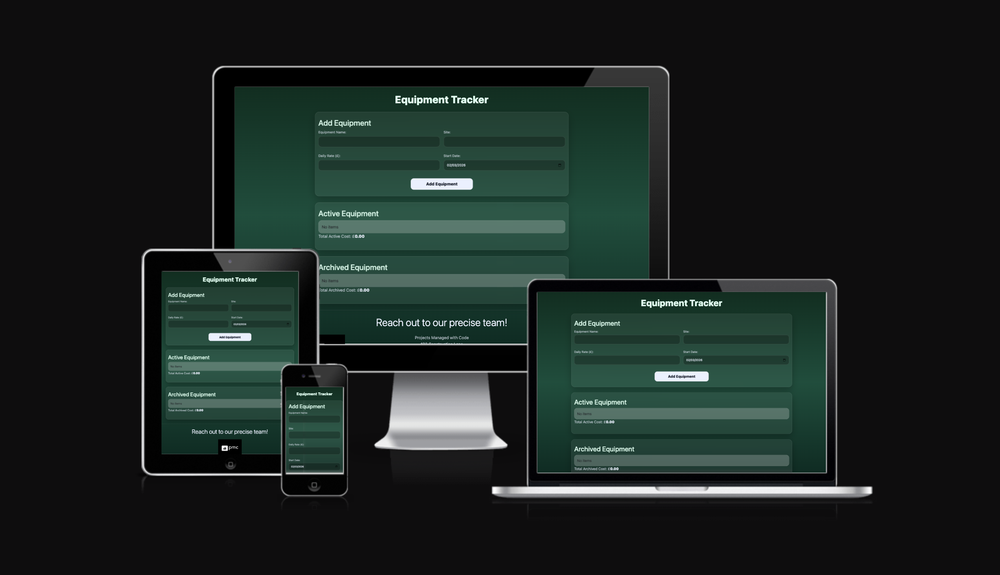

1. Project Goals
---
## Primary Goal

*To build a responsive web application that allows construction supervisors to track hired equipment, calculate cost exposure, and maintain a clear operational record of active and archived assets.

## Secondary Goals

*Demonstrate clean JavaScript architecture

*Implement state-driven rendering

*Use LocalStorage for persistence

*Apply responsive design principles

*Validate logic using automated testing (Jest)

2.User Experience (UX)
---
Target Audience:

Site Supervisors, Project Managers, Small Construction Businesses

These users require:

Quick visibility of hired assets, Clear cost tracking, Mobile accessibility on site
---

## Wireframes

Desktop Wireframe 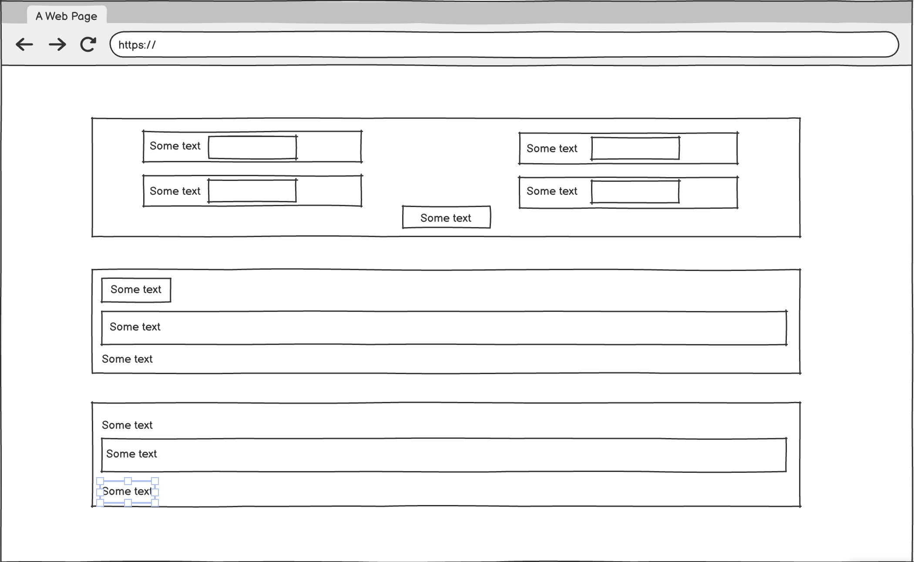

Tablet Wireframe 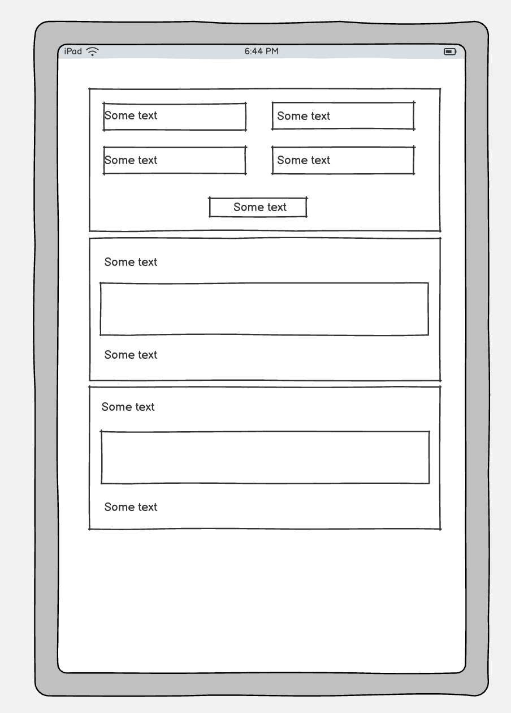

Mobile Wireframe 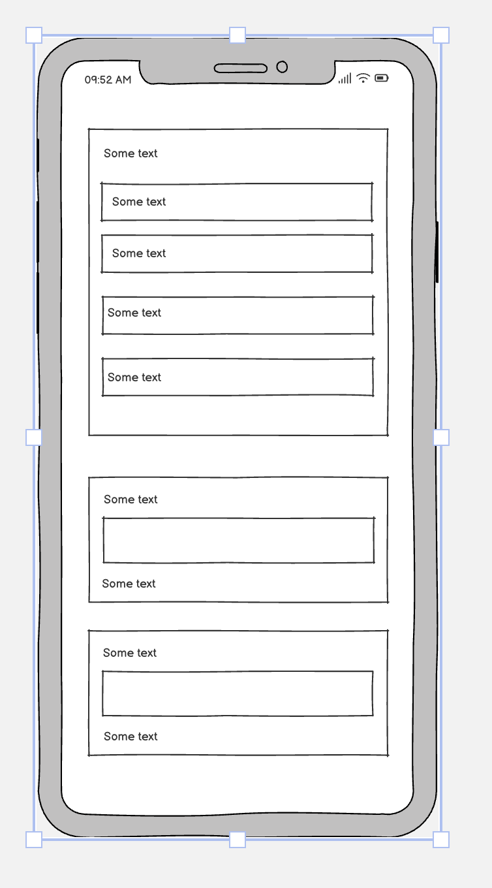

--- 

## User Stories

As a supervisor, I want to add hired equipment so that I can track what is currently on hire.

As a supervisor, I want to archive equipment when it is off-hired so that the active list remains accurate.

As a supervisor, I want to restore archived items if archived incorrectly.

As a supervisor, I want to delete incorrect entries.

Cost Tracking

As a project manager, I want to see real-time total hire cost so that I can monitor financial exposure.

As a manager, I want archived items to show start → end dates so that I can review hire duration.

### Accessibility & Responsiveness
As a user, I want the application to function on mobile, tablet and desktop devices.
---
3.Design
---
## Design Philosophy

The interface follows a SaaS-style layout:

* Card-based structure

* Clear visual separation between Active and Archived lists

* Strong typographic hierarchy

* Touch-friendly button sizing

* Minimal cognitive load

* Colour Scheme

* A green gradient background was selected to reflect construction and operational themes while maintaining high contrast for accessibility.

* Layout

* Flexbox used for alignment

* Grid used for form responsiveness

## Media queries applied for:

* 320px (small phones)    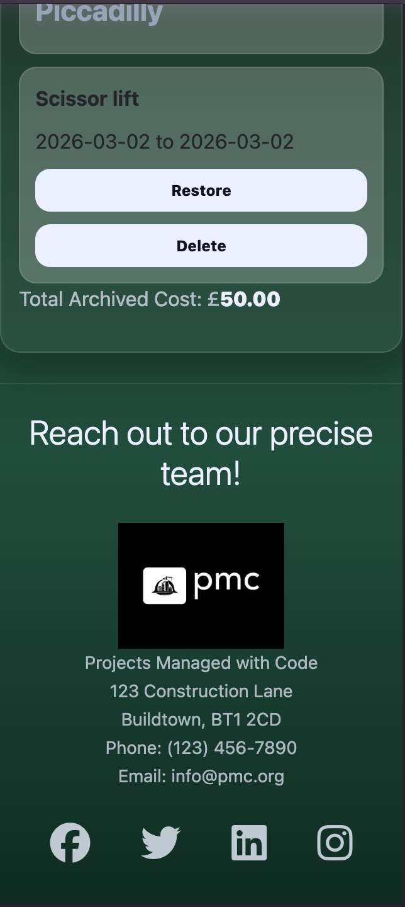

* 393px–430px (modern iPhones)   

* 768px (tablet)  

* 992px+ (desktop)  

--- 
4. Technologies Used
---

HTML

CSS (Flexbox, Grid, Media Queries, Variables)

JavaScript (ES6)

Bootstrap (layout utilities)

Font Awesome (icons)

Jest (unit testing)

5. Features

## Implemented Features

Add equipment with validation

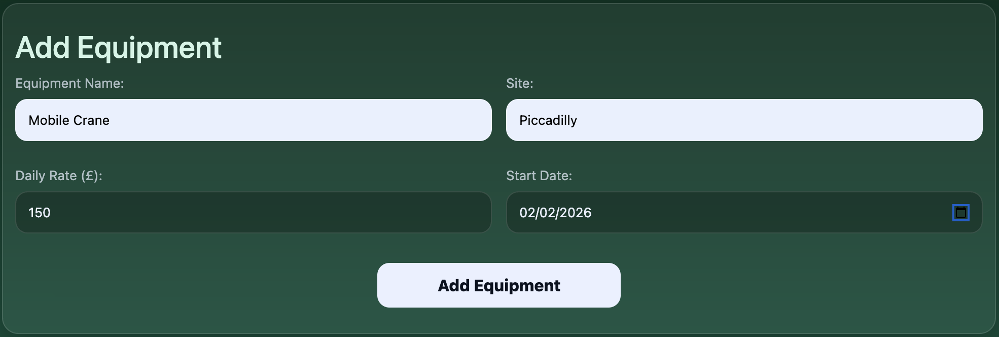
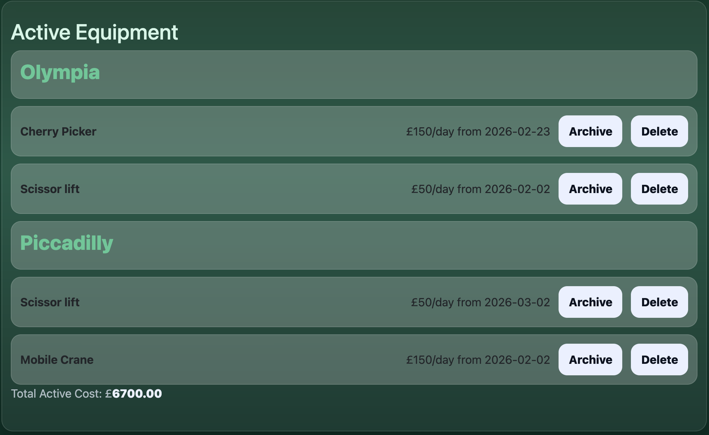

Group equipment by site

Archive equipment (auto records end date)

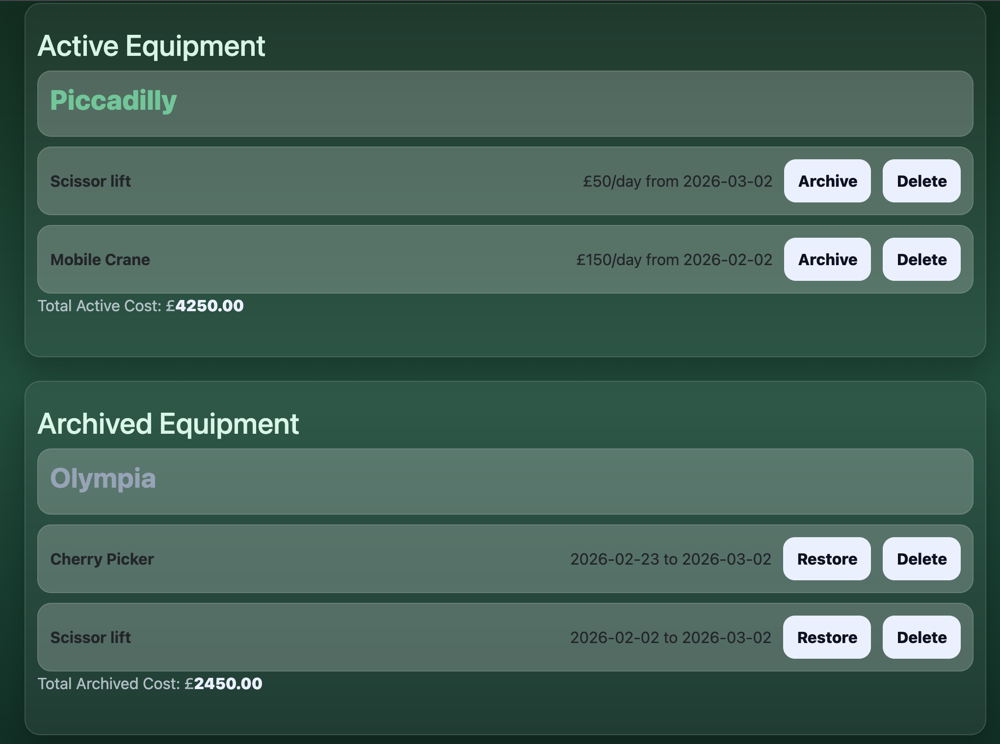

Restore archived equipment

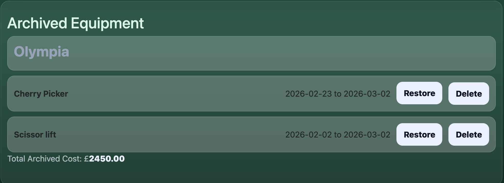
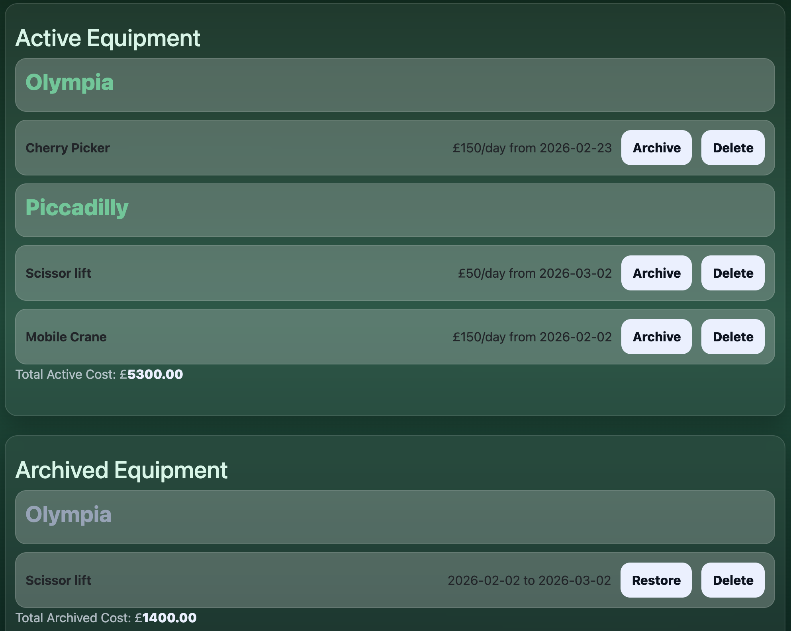

Delete equipment

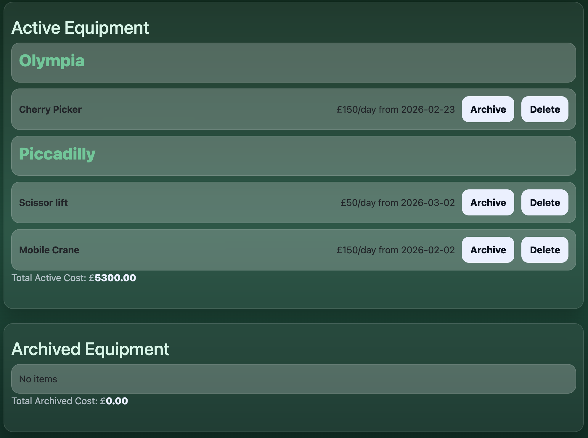

Real-time total cost calculation

6. Testing

Jest testing

Manual testing is completed by developers themselves and used to explore the app by testing form inputs, checking UI responsiveness, and trying to break it with invalid inputs.
It’s used for catching usability issues and unexpected behaviour early on. Automated testing uses tools like Jest to run fast, repeatable checks on code. It’s ideal for validating core functions like calcHireCost(), calcTotal(), deleteEquipment(), and local storage logic. Manual testing finds problems, automated testing prevents them from coming back.

Validation

Desktop
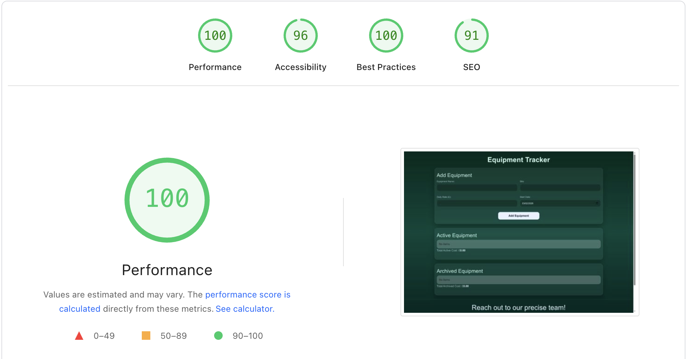

Mobile
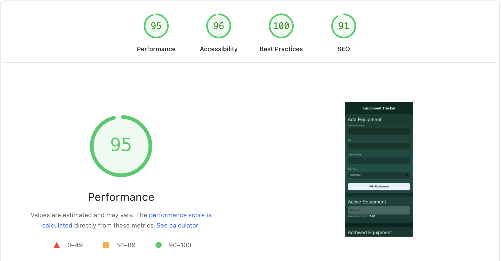

Tested on:

Chrome 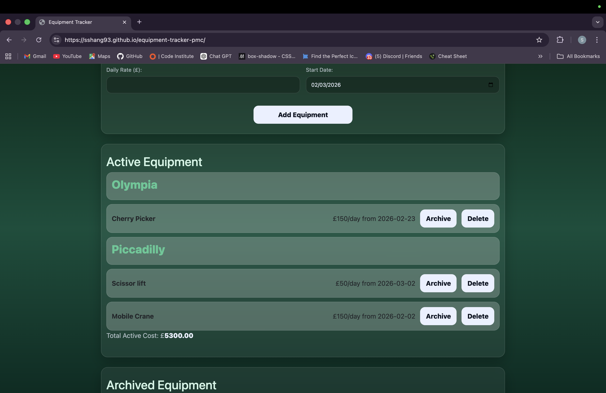

Safari 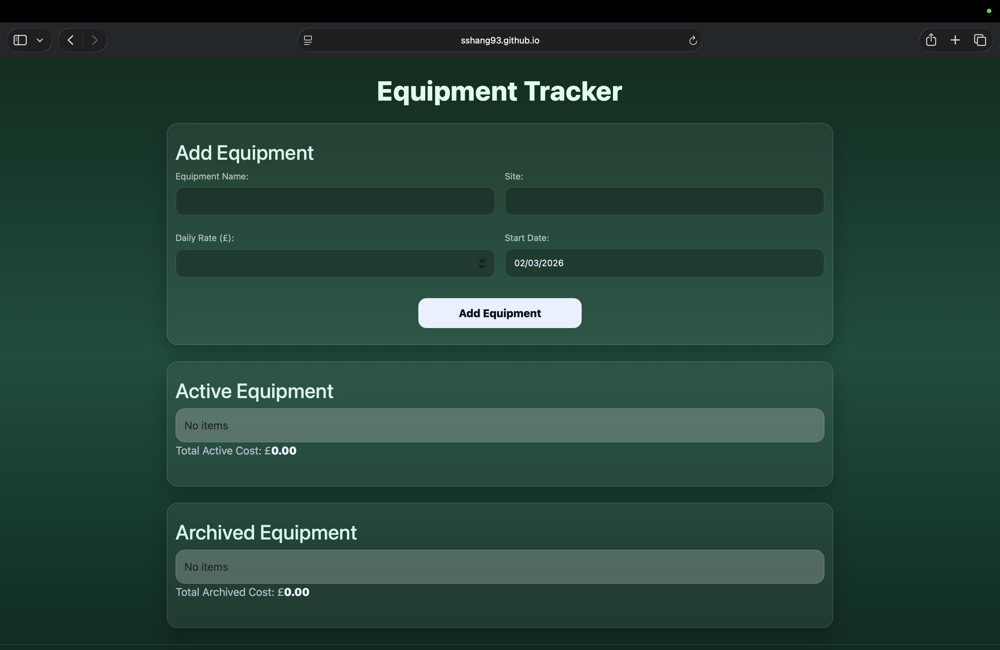

Firefox 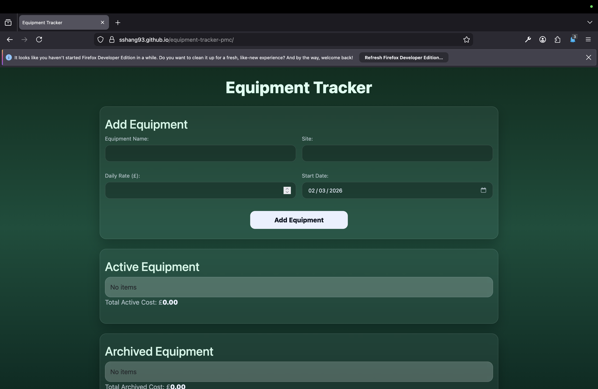

Mobile 

JS Lint 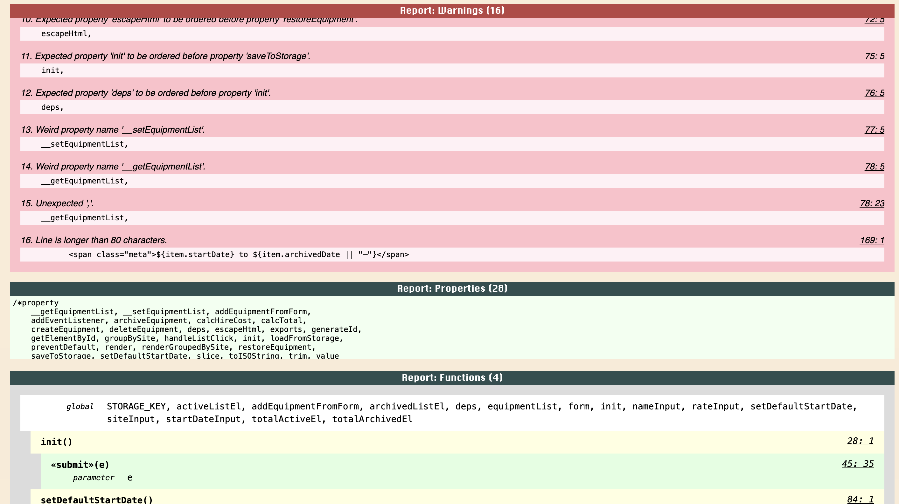

## State Management
---
All equipment data is stored in a central equipmentList array, which acts as the single source of truth for the application.
All UI rendering and cost calculations derive from this state, ensuring predictable and consistent behaviour.

This state-driven approach simplifies debugging, improves maintainability, and ensures that every UI update reflects the latest data.

### Separation of Concerns
--- 
The application architecture intentionally separates responsibilities:

Rendering logic is responsible only for updating the DOM.

Calculation logic handles cost computation and aggregation.

Storage logic manages interaction with LocalStorage.

Event handling logic manages user interactions through delegated listeners.

This separation reduces tight coupling between components and makes the codebase easier to extend and test.

### Event Delegation
---
Event delegation is used for dynamic list items (Archive, Restore, Delete buttons).

Rather than attaching individual listeners to each element, a single delegated listener handles interactions based on data-action attributes.

This approach:

Improves performance

Prevents duplicate event bindings

Keeps DOM manipulation clean

Supports dynamic rendering without re-binding events

### Mode-Based Rendering
---
A single rendering function handles both Active and Archived views using a mode parameter.

This design:

Eliminates duplicated rendering logic

Improves readability

Simplifies future feature expansion

Reduces maintenance complexity

### Scalability Considerations
---
Although the current implementation uses LocalStorage, storage access is abstracted through dedicated wrapper functions.

This allows:

Future replacement with a REST API

Migration to a database-backed solution

Integration with authentication

### Multi-user expansion
---
The current structure mirrors patterns commonly used in scalable front-end applications, providing a clear pathway to production-level architecture.

8. Deployment

The project is deployed via GitHub Pages by pushing the code to GitHub, enabling Pages in the repository settings, selecting the main branch root as the source, and accessing the generated GitHub Pages URL.

9. Reflection

This project demonstrates structured planning through user stories, state-driven UI rendering, real-world problem solving, responsive design implementation, automated logic testing, and forward-thinking architectural decisions.

It establishes a strong foundation for a scalable construction-focused SaaS application.
